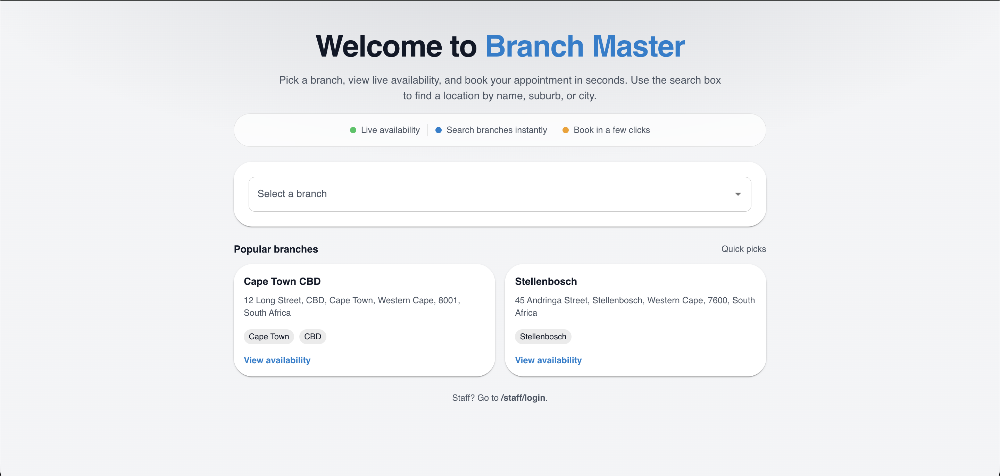
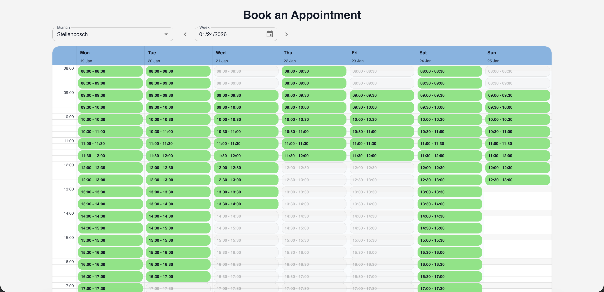
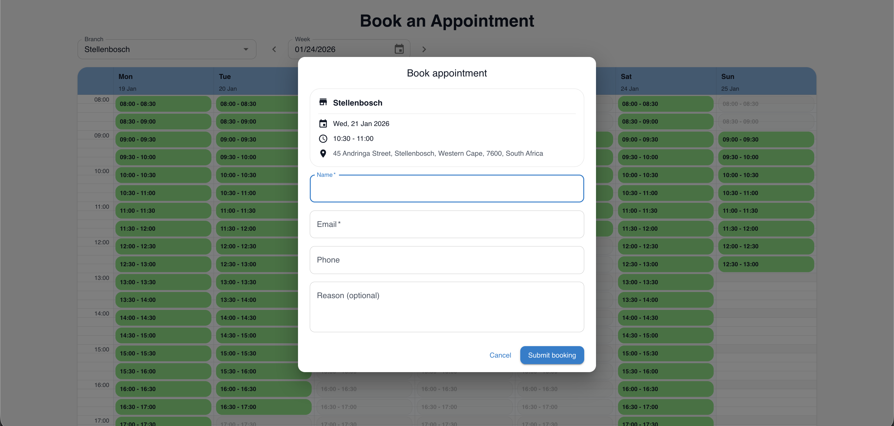
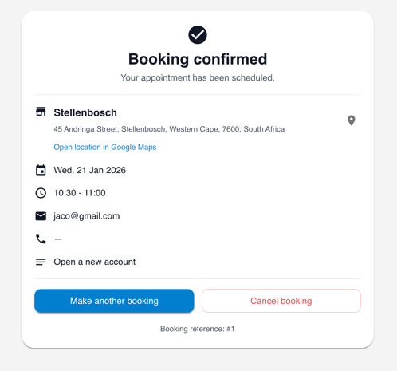
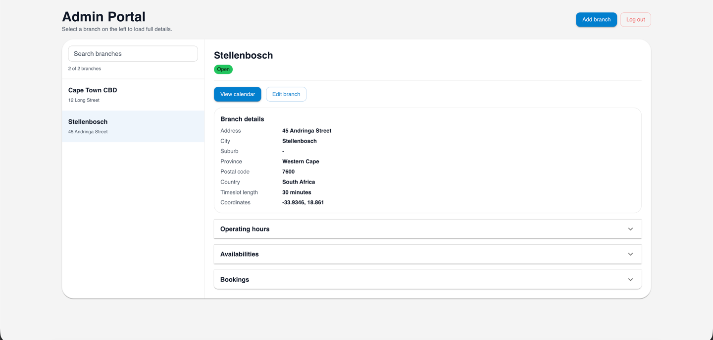
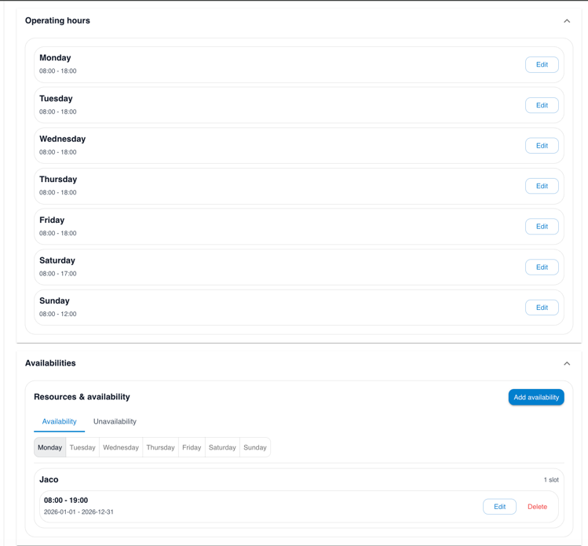
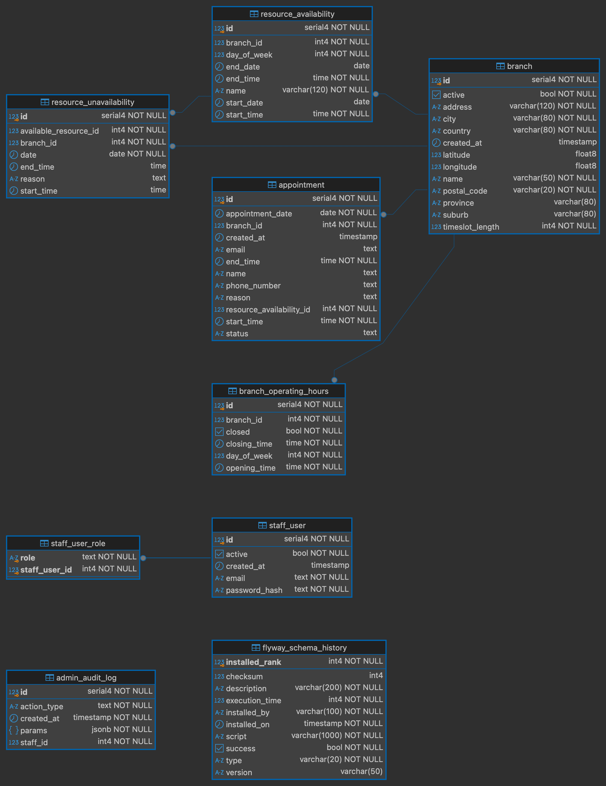

# Branchmaster – Docker Setup

Branchmaster is a full-stack appointment booking system that allows users to book appointments at physical branches and enables administrators to manage branches, resources, and bookings.

The project includes:
- **Frontend**: React + Vite
- **Backend**: Spring Boot
- **Database**: PostgreSQL

All components are orchestrated using **Docker Compose** and can be started with a single command.

---

## Prerequisites

You need the following installed:
- Docker (Docker Desktop recommended)
- Docker Compose (included with Docker Desktop)

---

## How to Run the Application

From the project root directory, run:

```bash
docker compose up --build
```

This command will:
- Build the frontend
- Build the backend
- Start PostgreSQL
- Start the backend service
- Start the frontend service

---

## Application URLs

- **Frontend:** http://localhost:5173
- **Backend:** http://localhost:8080
- **API Documentation (Swagger UI):** http://localhost:8080/swagger-ui.html
- **Database:** localhost:5432

Ensure no other applications are using these ports.

---

## Application Features

### User Features (Public Booking Flow)

Users can book appointments at branches through a simple, guided flow:

- **Branch selection**
    - Users can search for branches on the welcome page
    - Search works across multiple branch fields, including:
        - Branch name
        - Address
        - Suburb / city
        - Postal code
        - Country
    - A **quick-pick list** is also available for fast selection

- **View availability**
    - After selecting a branch, users are taken to a **calendar view**
    - The calendar displays available booking slots for that branch
    - Slots are generated based on branch operating hours and resource availability

- **Make a booking**
    - Users select an available time slot
    - They fill in basic personal details (name, email, phone number, reason)
    - The booking is created immediately after submission

- **Booking confirmation**
    - After a successful booking, users see a confirmation page containing:
        - Appointment details
        - Branch information
        - A **cancel booking** option
        - A **book another appointment** option
        - A **Google Maps link** that opens navigation to the selected branch

---

### Admin Features (Management Portal)

Administrators can manage the entire system via the admin portal:

- **Admin authentication**
    - Secure login to the admin portal

- **Branch management**
    - View a list of all branches
    - Create new branches
    - Edit existing branch details (address, location, configuration)

- **Operating hours**
    - Define and update branch operating hours
    - Control when bookings are allowed for each branch

- **Resource availability**
    - Add and update resource availabilities (e.g. rooms, counters, staff)
    - Define recurring availability by day and time range

- **Resource unavailability**
    - Add resource unavailability for specific dates and time ranges
    - Useful for leave, maintenance, or temporary closures

- **Appointment management**
    - View booked appointments for a selected branch and day
    - Monitor daily booking schedules

---

## Screenshots

### Branch Selection & Search
Users can search for branches using any available branch information (name, address, postal code, city, country) or select from a quick-pick list.



---

### Availability Calendar
After selecting a branch, users are shown a calendar view displaying available booking slots generated from branch operating hours and resource availability.



---

### Create Appointment
Users select a time slot and provide basic personal information to create a booking.



---

### Booking Confirmation
After a successful booking, users are shown a confirmation page with appointment details, options to cancel or book another appointment, and a Google Maps link for navigation to the branch.



---

### Admin – Branch Management
Administrators can view, create, and edit branches from the admin portal.



---

### Admin – Operating Hours & Resource Availability
Admins can manage branch operating hours, define recurring resource availability, and configure resource unavailability for specific dates and time ranges.



---

## Database Design (ERD)

The following Entity Relationship Diagram (ERD) illustrates the core domain model and relationships between branches, resources, operating hours, and appointments.



---

## Testing

- Unit test coverage: **84% line coverage**
- Coverage measured using **IntelliJ IDEA coverage runner**
- Tests focus on controller and service layers

---


## Admin Login Credentials

Use the following credentials to log in as an administrator:

- **Username:** `admin@local`
- **Password:** `admin123`

---

## Database Configuration

The application uses PostgreSQL with the following defaults:

- **Database name:** `branchmaster`
- **Username:** `branchmaster`
- **Password:** `branchmaster`
- **Port:** `5432`

The database schema and tables are created automatically on startup using **Flyway migrations**.  
No manual database setup is required.
